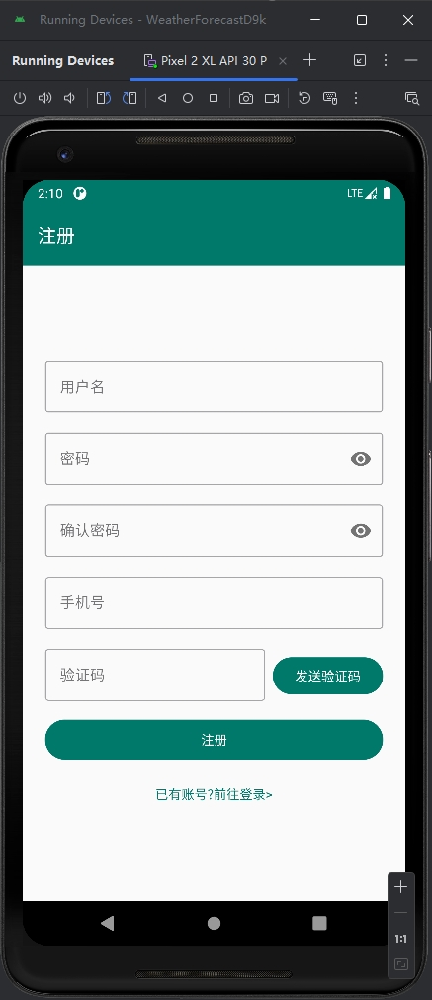
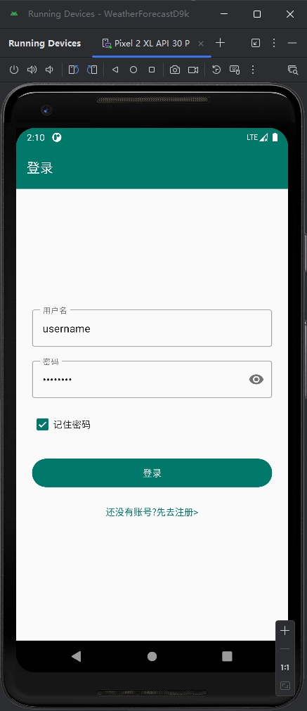
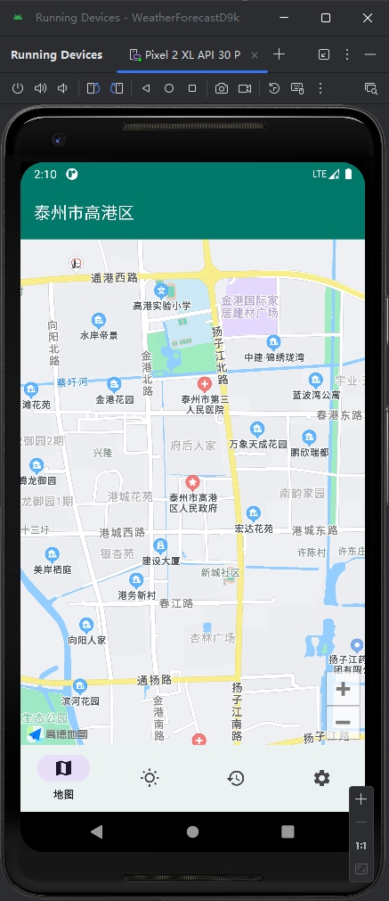
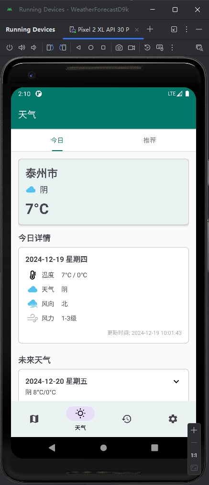
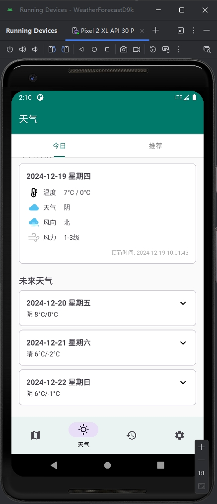
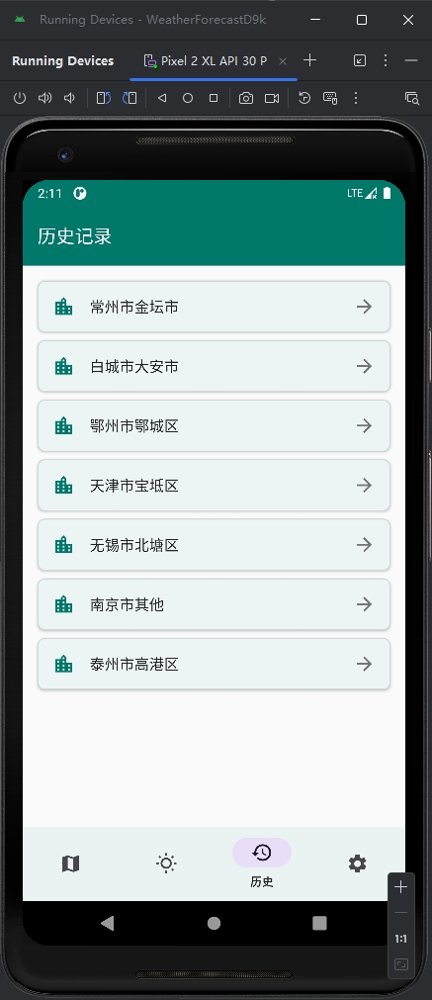
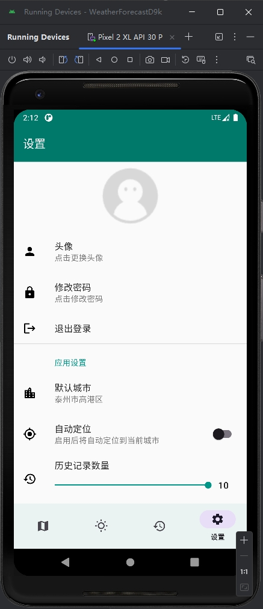

# WeatherForecastD9k - 天气预报应用

一个基于 Material Design 的 Android 天气预报应用，提供实时天气、未来天气预报、城市管理等功能。

## 功能特点

- 🌤️ 实时天气信息展示
- 📅 未来天气预报
- 🏙️ 城市管理（支持搜索和自动定位）
- 🕒 历史记录
- 🎨 每日必应壁纸
- 🔒 用户账户系统
- 📱 Material Design 3 设计风格

## 技术栈

- 💻 100% Kotlin/Java
- 🏗️ MVVM 架构
- 🔄 LiveData 数据流
- 🗃️ Room 数据库
- 🌐 Retrofit 网络请求
- 🎨 Material Design Components
- 🖼️ Glide 图片加载
- 📍 高德地图定位 SDK

## 截图
       

## 开始使用

1. 克隆仓库
```bash
git clone https://github.com/yourusername/WeatherForecastD9k.git
```

2. 在 Android Studio 中打开项目

3. 配置 API Keys
   - 在 `local.properties` 中添加：
```properties
AMAP_KEY=你的高德地图KEY
WEATHER_API_KEY=你的天气API KEY
```

==补药使用我的API KEY啊==

4. 运行项目

## API 来源

- 天气数据：高德地图 API
- 定位服务：高德地图 API
- 每日图片：必应壁纸 API
- 二维码生成：品味二维码 API

## 贡献

欢迎提交 Issue 和 Pull Request！

## 许可证

```
Copyright 2024 d0ublecl1ck

Licensed under the Apache License, Version 2.0 (the "License");
you may not use this file except in compliance with the License.
You may obtain a copy of the License at

    http://www.apache.org/licenses/LICENSE-2.0

Unless required by applicable law or agreed to in writing, software
distributed under the License is distributed on an "AS IS" BASIS,
WITHOUT WARRANTIES OR CONDITIONS OF ANY KIND, either express or implied.
See the License for the specific language governing permissions and
limitations under the License.
```